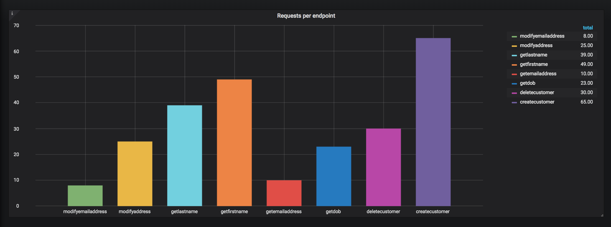
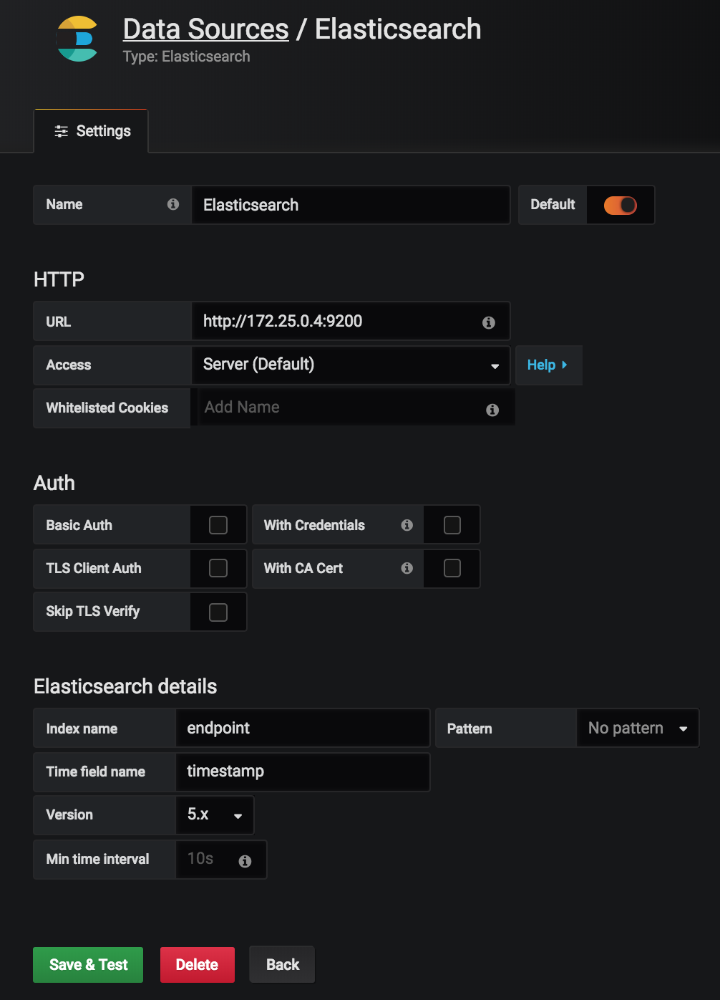

<p align="center">
  
</p>

<h1 align="center">Functional Test Coverage Tool</h1>

<div align="center">
  Functional Test Coverage/Analysis for Automated Tests (UI & API based).
</div>


<div align="center">
  <sub>Part of a group of super small repositories demonstrating some of the stuff I have done around Test Automation :necktie:</sub>
</div>

#
> Test measurement allows better product quality

## Synopsis
The majority of code coverage tools in the market are based around coverage for _Unit Tests_. There doesn't seem to be any **Test** coverage tools for functional tests such as browser based or API based.
This is a simple demonstration on how you can generate, visualize and analyse test coverage for your functional tests.

<h5 align="center">Requests per endpoint during execution - in real-time</h5>
<p align="center">
  
</p>


This demonstration meerly scratches the surface in terms of what test coverage statistics you can extract from an automated test suite and because it's simple, the approach can be adapted by any Test Framework. Using this approach you can quickly and easily;

* Perform gap-analysis on test suites
* Visualise test execution statistics by things such as application area, business requirements, customer journys etc
* Easily compare test suite traffic against production traffic


## Demonstration

### Tools
* Java
* Docker
* Grafana
* ElasticSearch
* Kibana


For demonstration purposes, I have created a bunch of small _TestNG_ tests (see example) which send HTTP requests to _fake_ API endpoints - fake because no request is actually sent.
```Java
@Test(invocationCount = 54)
    public void createCustomer() {
        new RequestHandler().createCustomer();        
    }
```

There are `8` endpoints in total `CreateCustomer, DeleteCustomer, ModifyAddress, ModifyEmail, GetFirstName, GetLastName, GetDob, GetEmailAddress`
```Java
public void createCustomer(){
        send(HttpRequest.newBuilder()
                .uri(buildURI("createCustomer"))
                .POST(HttpRequest.BodyPublishers.ofString("some json body"))
                .build());
    }
```

The aim in the demo is to see the level of test coverage there is for each endpoint in my _application_. A simple measure could be to calculate the number of requests made per endpoint. From this, I can quickly see if there are any untested endpoints. 


## How does it work

The idea is to get and store information from every request before it is sent. This information is then sent to `ElasticSearch`, and visualized using graphs/charts in `Grafana`.


### Extract data
Before _sending_ the Http request, you need to extract as much information from the request as you deem useful. In this demo both the Http Method type i.e. `PUT, POST, GET` and the `URI` path are extracted. - i.e. `POST` and `createCustomer` respectively. As well as this information, a timestamp is also generated. In the case of the demo, the data is stored inside an `Endpoint` object.
```Java
private void send(HttpRequest httpRequest) {

        Endpoint endpoint = new Endpoint();
        endpoint
                .setTimestamp(Instant.now().toEpochMilli())
                .setMethod(httpRequest.method())
                .setPath(httpRequest.uri().getPath());

        sendDataToElasticSearch(endpoint);

        // now send the request as normal
    }
```

### Store data
The `Endpoint` object is then sent to `ElasticSearch` in `JSON` format
```Java
try {
            HttpRequest request = HttpRequest.newBuilder()
                    .uri(new URI("http", null, "127.0.0.1", 9200, "/endpoint/test", null, null))
                    .header("Content-Type", "application/json")
                    .POST(HttpRequest.BodyPublishers.ofString(new Gson().toJson(endpoint)))
                    .build();

            HttpResponse<String> response = httpClient.send(request, HttpResponse.BodyHandlers.ofString());
            Assert.assertEquals(response.statusCode(), 201);
        } catch (Exception e) {
            e.printStackTrace();
        }
```
This is the data we stored for each request - as displayed in `Kibana`
```json
{
  "_index": "endpoint",
  "_type": "test",
  "_id": "eULJLmkB3jE445mFxKIi",
  "_version": 1,
  "_score": null,
  "_source": {
    "timestamp": 1551214157000,
    "method": "POST",
    "path": "/createCustomer"
  },
  "fields": {
    "timestamp": [
      "2019-02-26T20:49:17.964Z"
    ]
  },
  "sort": [
    1551214157000
  ]
}
```

### Visualise data
You can create graphs/charts etc in Grafana in order to visualise the ElasticSeach logs. Here is a visualisation of the _Requests made by endpoint_ when running my test suite. The graph below shows _createcustomer_ was the most hit endpoint and _modifyemailaddress_ the least - should I look to add more tests around modifyEmailAddress :think:


<p align="center">
  
</p>


## Running the Demo
To get this demo up and running:

#### Spin up Docker Containers
Start the docker containers using the _docker_compose_ file in the `Docker` folder
```bash
docker-compose build && docker-compose up
```
This will spin up `3` containers which can be accessed by navigating to the following url's
* ElasticSearch (http://127.0.0.1:9200)
* Kibana - (http://127.0.0.1:5601)
* Grafana ((http://127.0.0.1:3000)

#### Run Tests
Run the tests in `TestEndpoints`. A `@BeforeSuite` execution hook is triggered which will create a index in ElasticSearch called `endpoint`. Once the tests have finished running, you can add the Index Pattern `endpoint` and hopefully see the data sent by thee tests.


#### Configure Grafana
Setup Grafana by adding `ElasticSearch` as the datasource and `endpoint` as the index. Finally, create graphs as desired.

<p align="center">
  
</p>

